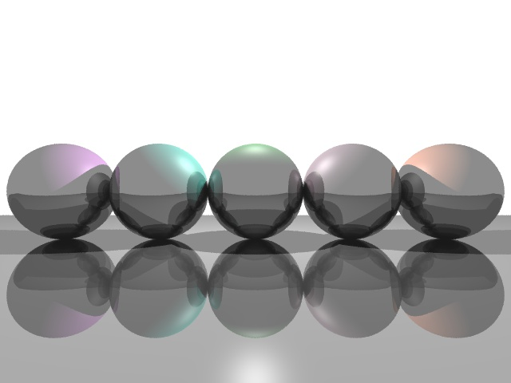
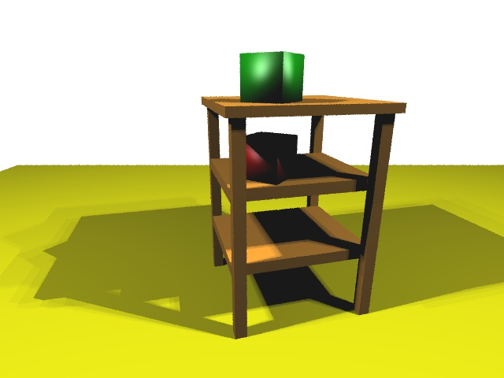

# Ray Tracer

Generates a 2D image by emitting light rays and simulating the effects of their intersections with virtual 3D objects

spheres.scene             | table.scene
:------------------------:|:-----------------------------------:
          | 
10 rays/pixel, 10 bounces | 5 rays/pixel, 10 extra lights/light

## Features
- Light rays intersect objects composed of
  - Triangles
  - Spheres
- Phong shading
- Anti-aliasing via jittered supersampling
- Recursive reflection
- Soft shadows

## Build
- Execute `make`
- Compiles for macOS and Linux

## Usage
- `rtrace <input scenefile> <rays per pixel> <reflection bounces> <extra lights per light> [output jpegname]`
  - rays per pixel: if >1, supersampling is applied. use 1 as default
  - reflection bounces: depth of reflection recursion. use 0 as default
  - extra lights per light: if >0, soft shadows are applied. use 0 as default
  - output jpegname: if not provided, no output jpeg file will be generated
- Sample scene files are in the scenes directory

## Built With
- [OpenGL](https://www.opengl.org/)
- [OpenGL Mathematics (GLM)](https://glm.g-truc.net)
- [Vega FEM's imageIO Library](http://barbic.usc.edu/vega/)

## Author
Alfonso Castellanos

## License
MIT @ [Alfonso Castellanos](https://github.com/fonzcastellanos)

## Acknowledgements
Professor Jernej Barbic for his [computer graphics class](http://barbic.usc.edu/cs420-s17/)
